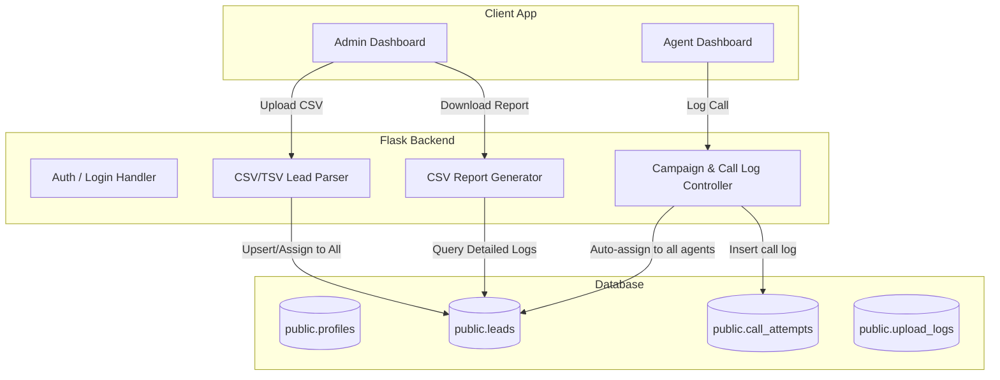
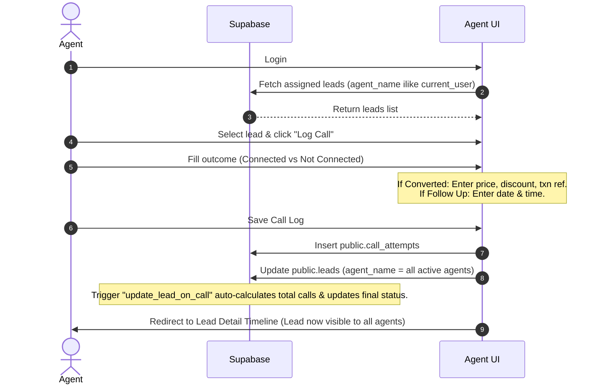

# TFU CRM — AI-Enabled Lead Management Platform

TFU CRM is a high-performance, responsive web application designed for lead management, campaign tracking, and call logging. It features role-based access control (Admin/Agent), automated lead parsing, flexible multi-agent assignment, interactive dashboards, detailed performance reports, and real-time CRM updates powered by Supabase.

---

## 📖 Table of Contents
1. [Architecture & Flow Diagram](#-architecture--flow-diagram)
2. [Key Features](#-key-features)
3. [Technology Stack](#-technology-stack)
4. [Database Schema](#-database-schema)
5. [Application User Flows](#-application-user-flows)
   - [Admin User Flow](#1-admin-user-flow)
   - [Agent User Flow](#2-agent-user-flow)
6. [Local Installation & Setup](#-local-installation--setup)
7. [Testing & Verification](#-testing--verification)

---

## 📐 Architecture & Flow Diagram



---

## 🌟 Key Features

### 👤 Role-Based Access Control (RBAC)
* **Admin Role:** Full visibility over all campaigns, agent performance metrics, lead uploads, bulk assignments, password resets, detailed CSV report exports, and custom agent campaign permission assignment.
* **Agent Role:** Access restricted to campaigns explicitly assigned to them by the administrator. Agents log calls, track conversion details, and view static performance stats.

### 💼 Dynamic Agent Campaign Assignment
* **Granular Assignment:** Admins can assign individual agents to one or multiple campaigns from the agents dashboard at any time.
* **Fallback Mappings:** If no campaigns are explicitly assigned, it defaults to the team name based mappings (`SIA_STA_TEAM`, `FP_TEAM`, `UPSELL_TEAM`) to ensure seamless backward compatibility.

### ⏳ Performance Metrics & Revenue Tracking
* **Logical Pending Stats:** The agent "Pending" statistic is calculated mathematically as `Pending = Dialed Leads - Connected Leads` (dialed leads that have not successfully connected).
* **Call Stats Tracking:** Displays total attempted calls and successful connected calls on the admin dashboard.
* **Revenue Tracking:** Displays total sales collections across all converted lead payments, formatted in Indian Rupees (INR).

### ⚡ High Performance & Database Pagination
* **20-Limit Pagination:** Display exactly 20 items per page across all listing views (leads list, campaign lists, follow-up lists) and admin dashboard panels to optimize server and database load.
* **Parallel Query Worker Thread Pools:** Parallelizes concurrent count queries using thread workers (up to 10 on the admin dashboard and 15 on the agent dashboard) to ensure sub-second page rendering.
* **Optimized Follow-up Lookups:** Uses streamlined DB queries to fetch all active follow-up schedules in a single request instead of serial chunked lists.

### 📥 Automated Lead Upload & Parsing
* **Flexible Parsers:** Supports CSV, TSV, and text uploads.
* **Intelligent Title Separation:** Automatically detects and separates lead name from bootcamp title (e.g. `8888814280 Satyajit | AtPitch_June10` splits into phone, name, and bootcamp).
* **Multi-Agent Assignment:** Uploaded leads can be assigned to multiple agents or auto-assigned to all active agents by default.

### 📊 Detailed Reporting & Exports
* **Live Statistics:** Track total leads, conversions, follow-ups, today's call attempts, and recent uploads.
* **Detailed CSV Export:** Download a detailed report containing lead profiles, payment tracking, total attempts, conversion status, and up to 10 separate attempt details (each containing Attempt Time, Agent, Status, Disposition, and Comments). All exported timestamps are converted to Indian Standard Time (IST) formatted as `YYYY-MM-DD hh:mm AM/PM`.

### 🔄 Multi-Agent Auto-Sharing on Call Entry
* **Shared Lead Execution:** When an agent logs a call attempt/entry on a lead, the lead's `agent_name` column is updated to include all active agents.
* **Immediate Visibility:** The lead dynamically appears on all agents' dashboards, allowing seamless team-wide tracking.

### 🔓 Aligned Lead Access Rules
* **Unified Access Check:** Enforces access rules using `has_lead_access(lead, user)` across all agent detail, logging, and status update API endpoints.
* **Global Visibility for Shared States:** Leads in shared statuses (e.g. `Pending`, `Not Connected`, `DNP`, `Converted`, `Already Enrolled`, etc.) are globally viewable and loggable by any agent who has campaign permissions, resolving "Access denied" issues for new agents on older/pre-existing leads.
* **Follow-up Ownership Security:** Follow-up tasks remain restricted so that only the agent who made the original call and scheduled the follow-up can view or log attempts on it.

### 🗑️ Global Visibility for Discarded Leads
* **Discarded Lead Sharing:** When any lead is marked with the final status `Discarded` (either directly or via logging a call attempt outcome as `discarded`), it becomes globally visible and accessible to all agents who have permission for that campaign type.
* **Open to Contact:** Discarded leads bypass ownership checks, allowing any permitted agent to view the lead's details, access call history / follow-up timelines, and log additional call attempts.

### 🔍 Campaign Agent Filtering & Cleaner Tables
* **Agent Filter Dropdown:** Agents can filter campaign leads dynamically using the Agent Filter Dropdown in the filter bar, which shows only the agents who have ever contacted leads in that campaign.
* **Caller Display:** Clean table columns show the actual agent who called/contacted the lead (e.g. `🎧 Called by: Ameen`) instead of displaying a cluttered list of all auto-assigned agents.

### 💾 Zero-Dependency Local Caching
* **Read Cache:** Implements a memory-efficient, thread-safe local caching layer for allowed campaigns (5 min), campaign active agents (60s), and sidebar statistics (15s) to guarantee sub-second page loads and reduce database reads.


---

## 🛠 Technology Stack
* **Backend:** Python / Flask (Session-based Authentication)
* **Frontend:** Responsive HTML5, Jinja2 Templates, Vanilla CSS (Modern Dark Mode Interface)
* **Database:** Supabase (Postgres) with Row-Level Security (RLS) and custom PL/pgSQL triggers.

---

## 🗄 Database Schema

### 1. `public.profiles` (User Profiles)
Stores information about admins and agents.
```sql
CREATE TABLE public.profiles (
    id UUID PRIMARY KEY REFERENCES auth.users(id) ON DELETE CASCADE,
    name TEXT NOT NULL,
    email TEXT UNIQUE NOT NULL,
    role TEXT NOT NULL CHECK (role IN ('admin', 'agent')),
    is_active BOOLEAN DEFAULT TRUE,
    password TEXT, -- Encrypted/Hashed local passwords
    campaigns TEXT, -- Comma-separated list of assigned campaign types (e.g. 'atpitch_sia,fp_l1')
    created_at TIMESTAMPTZ DEFAULT NOW(),
    updated_at TIMESTAMPTZ DEFAULT NOW()
);
```

### 2. `public.leads` (Leads Information)
Stores uploaded leads and active campaign status.
```sql
CREATE TABLE public.leads (
    id UUID PRIMARY KEY DEFAULT uuid_generate_v4(),
    unique_key TEXT UNIQUE NOT NULL, -- prevents duplicate entries on upload
    campaign_type TEXT NOT NULL CHECK (campaign_type IN (
        'atpitch_sia', 'atpitch_sta', 'atpitch_others', 'upsell', 'fp_l1', 'fp_l2'
    )),
    lead_type TEXT,
    lead_name TEXT,
    contact_no TEXT NOT NULL,
    bootcamp_title TEXT NOT NULL,
    bootcamp_date TEXT,
    agent_name TEXT, -- Comma-separated active agents assigned to this lead
    priority TEXT,
    email TEXT,
    amount NUMERIC(10,2),
    payment_status TEXT,
    course_level TEXT,
    comment TEXT,
    coupon_code TEXT,
    payment_method_type TEXT,
    fp_date DATE,
    fp_time TIME,
    calling_for_upsell TEXT,
    joining_duration TEXT,
    uploaded_by UUID,
    upload_batch TEXT,
    raw_data JSONB,
    final_status TEXT DEFAULT 'Pending',
    last_call_date TIMESTAMPTZ,
    total_attempts INT DEFAULT 0,
    created_at TIMESTAMPTZ DEFAULT NOW(),
    updated_at TIMESTAMPTZ DEFAULT NOW()
);
```

### 3. `public.call_attempts` (Call Logs Timeline)
Tracks individual call records logged by agents.
```sql
CREATE TABLE public.call_attempts (
    id UUID PRIMARY KEY DEFAULT uuid_generate_v4(),
    lead_id UUID NOT NULL REFERENCES public.leads(id) ON DELETE CASCADE,
    attempt_number INT NOT NULL,
    agent_id UUID,
    agent_name TEXT,
    called_at TIMESTAMPTZ DEFAULT NOW(),
    connected BOOLEAN NOT NULL DEFAULT FALSE,
    not_connected_reason TEXT CHECK (not_connected_reason IN (
        'not_connected', 'internet_issue', 'call_failure', 'switched_off', 'busy', 'ringing_no_answer'
    )),
    call_status TEXT CHECK (call_status IN (
        'follow_up', 'converted', 'already_enrolled', 'need_more_detail', 'not_interested', 'discarded'
    )),
    disposition TEXT,
    comments TEXT,
    follow_up_date DATE,
    follow_up_time TIME,
    follow_up_done BOOLEAN DEFAULT FALSE,
    amount_paid NUMERIC(10,2),
    token_amount NUMERIC(10,2),
    discount_amount NUMERIC(10,2),
    bootcamp_price NUMERIC(10,2),
    payment_mode TEXT,
    payment_reference TEXT,
    created_at TIMESTAMPTZ DEFAULT NOW(),
    updated_at TIMESTAMPTZ DEFAULT NOW(),
    UNIQUE(lead_id, attempt_number)
);
```

### 4. `public.upload_logs` (Import History)
Tracks CSV upload sessions.
```sql
CREATE TABLE public.upload_logs (
    id UUID PRIMARY KEY DEFAULT uuid_generate_v4(),
    uploaded_by UUID,
    campaign_type TEXT NOT NULL,
    filename TEXT,
    total_rows INT DEFAULT 0,
    inserted_rows INT DEFAULT 0,
    duplicate_rows INT DEFAULT 0,
    error_rows INT DEFAULT 0,
    errors JSONB DEFAULT '[]',
    created_at TIMESTAMPTZ DEFAULT NOW()
);
```

---

## 🔄 Application User Flows

### 1. Admin User Flow

#### A. Uploading Leads
1. Navigate to **Upload Leads**.
2. Select target **Campaign Type** (e.g. Atpitch SIA, FP L1).
3. Choose a `.csv`, `.tsv`, or `.txt` file.
4. **Assign Agents:** Select specific agents via the checkbox dropdown, or leave blank to **Auto-Assign to All Agents**.
5. Click **Upload**. The system parses metadata, removes duplicates via `unique_key`, and assigns the leads.

#### B. Managing Assignments
1. Go to **All Leads**.
2. Check boxes next to leads you want to assign or unassign.
3. Choose the target agents in the **Sticky Bulk Action Bar**.
4. Save to distribute.

#### C. Downloading CSV Reports
1. Navigate to **Dashboard**.
2. Click **Download Detailed Report** to generate a comprehensive CSV detailing lead information, payment statuses, and timelines.

---

### 2. Agent User Flow



#### A. Dashboard & Campaigns
1. Agents log in at `/login`.
2. The agent dashboard presents the active campaigns showing **Total**, **Pending**, and **Follow Up** leads assigned specifically to them.
3. Click on a campaign to view leads. Filters (Status, Priority) and Live Search can be used to locate records.

#### B. Logging a Call
1. Click **View →** on any lead, then click **📞 Log Call**.
2. Select **Connection Status**:
   * **Connected:** Set outcome status (e.g., Converted, Follow Up, Already Enrolled) and write comments.
     * *Follow Up:* Select schedule date and time.
     * *Converted:* Log bootcamp price, token paid, discounts given, and transaction reference.
   * **Not Connected:** Select specific reason (e.g., Phone Switched Off, Busy, Network Error).
3. If logged in as Admin, the optional **Transfer Lead to** dropdown is shown.
4. Click **Save Call Log**. The lead is automatically shared with all active agents, and the timeline shows the update chronological history.

---

## 🚀 Local Installation & Setup

### 1. Prerequisites
* Python 3.9+
* Supabase Account & Database Project

### 2. Project Installation
```bash
# Clone the repository
git clone https://github.com/Ankitdahiya2002/AI-Enabled-Lead-Management-CRM-Platform.git
cd AI-Enabled-Lead-Management-CRM-Platform

# Set up virtual environment
python3 -m venv venv
source venv/bin/activate

# Install dependencies
pip install -r requirements.txt
```

### 3. Environment Variables Config (`.env`)
Create a `.env` file in the root directory:
```env
FLASK_APP=app.py
FLASK_ENV=development
SECRET_KEY=your_flask_secret_key_here

SUPABASE_URL=https://your-project.supabase.co
SUPABASE_KEY=your-supabase-anon-key
SUPABASE_SERVICE_KEY=your-supabase-service-role-key
```

### 4. Database Setup
1. Paste the raw SQL from `supabase/001_init.sql` into the **SQL Editor** of your Supabase Dashboard and click **Run**.
2. Initialize schema configurations and create the primary administrator account:
   ```bash
   python setup_admin.py
   ```

### 5. Running the Dev Server
```bash
# Start server
bash start.sh
```
The server will start locally at **`http://localhost:5000`**.

---

## 🧪 Testing & Verification
We maintain integration tests to verify database workflows and application behaviors. Run them using the local python environment:

```bash
# Verify detailed CSV report generation
venv/bin/python test_csv_export.py

# Verify auto assignment to all active agents
venv/bin/python test_upload_auto_assign.py

# Verify agent-initiated lead transfer
venv/bin/python test_agent_lead_transfer.py

# Verify lead auto-sharing on call entry
venv/bin/python test_show_all_agents_on_entry.py
```

---

## 📜 Changelog

### v2.4 (June 2026)
* **Optimization & Filtering Features:**
  * Added campaign-wise **Agent Filter Dropdown** on all agent campaign pages.
  * Preserved search, status, priority, and agent filters across all pagination links and quick status/priority chips.
  * Aligned detail page and call log access checks to match listing visibility. Shared campaign leads (Pending, Not Connected, Converted, etc.) are now accessible to all campaign-allowed agents, fixing access denied errors for new agents.
  * Optimized table layouts in all listings to display only the caller (e.g. `Called by: Ameen`) instead of the verbose comma-separated list of all 17 assigned agents.
  * Implemented zero-dependency in-memory caching for allowed campaigns (5 min), campaign active agents (60s), and sidebar statistics (15s) to ensure instant page loads and minimize database read operations.

### v2.3 (June 2026)
* **Bug Fixes:**
  * Fixed a bug where selecting a campaign from the admin dashboard campaign filter dropdown would auto-redirect and reset back to "All Campaigns" on page reload.
  * Cleaned up the campaign filter UI styling (removed target emoji indicator from the select element container).

### v2.2 (June 2026)
* **Improvements & Features:**
  * Added team-wide auto-sharing on call entry (any call attempt updates lead assignments to all active agents automatically).
  * Made all unconnected statuses (Not Connected, DNP, Switched Off, Line Busy, Call Failure) and "Not Attended Class" visible to all agents in the campaign.

       ### Developed by Ankit Dahiya @2026
     ##eMAIL-: dahiyaankit38@gmail.com

